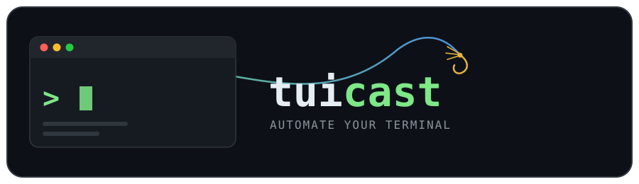

# tuicast

## Table of Contents
- [Background](#Background)
- [Installation](#installation)
- [Running the Reference TUI](#running-the-reference-tui)

## Background
- Goal
  - To create a TUI automation framework, allowing you to control a terminal based application programatically. Use cases for such a framework include:
    - End-to-end (E2E) testing - simulate a real user flow and assert the app behaves correctly
    - Automation - expose a surface for terminal applications to be integrated into automated workflows

> TUICast makes terminal-based applications testable and automatable through reliable, programmatic control of interactive terminal sessions. It abstracts connection protocols and terminal behavior so engineers can interact with legacy TUIs using deterministic, modern automation APIs.

- Background and problem
  - Some enterprise systems still use interactive terminal interfaces over SSH or Telnet. Automating them can be challenging because they are stateful screen applications rather than command-line programs:
    - Output arrives incrementally.
    - Escape sequences update an existing screen.
    - Input includes special keys, not just text.
    - Applications often provide no explicit "ready" signal.
    - Tests may need hundreds of isolated, concurrent sessions.
  - TUICast provides one abstraction over those concerns.

- Intended users
  - Engineers testing legacy enterprise TUI applications
  - Teams integrating terminal-only systems into automated workflows
  - Test-tool and SDK authors
  - AI agents or orchestration systems that need controlled TUI access

- Primary use cases
  - End-to-end testing: Perform realistic user workflows and assert screen contents, cursor position, or other terminal state.
  - Business-process automation: Integrate terminal-only applications into larger workflows.
  - Concurrency and load scenarios: Run many independent users or sessions simultaneously.
  - Observability and diagnostics: Capture terminal state and failures in a form test tools can report.
  - Language-neutral integration: Control TUICast through its driver and language SDKs.
  - AI-assisted operation: Expose a constrained terminal automation surface through MCP  

- Glossary

## Installation

### SDK

The SDK launches tuicast-driver, so install that separately and make sure it is available on your PATH.

#### Go

To install the SDK for Go, use go get.
```
go get github.com/castingcode/tuicast/sdk/go@latest
```
Then in your code, import the SDK as:
```
import tuicast "github.com/castingcode/tuicast/sdk/go"
```

### Driver and Other Binaries - Using the install script

The default destination is ./bin. Add the selected directory to PATH if necessary.

#### macOS and Linux

Install the driver into ./bin:
```
curl --proto '=https' --tlsv1.2 -LsSf \
  https://github.com/castingcode/tuicast/releases/latest/download/install.sh | sh
```

Install the reference TUI:
```
curl --proto '=https' --tlsv1.2 -LsSf \
  https://github.com/castingcode/tuicast/releases/latest/download/install.sh |
  sh -s -- --component reference-tui
```

Install everything into ~/.local/bin:
```
curl --proto '=https' --tlsv1.2 -LsSf \
  https://github.com/castingcode/tuicast/releases/latest/download/install.sh |
  sh -s -- --component all --bin-dir "$HOME/.local/bin"
```

Install a specific version:
```
curl --proto '=https' --tlsv1.2 -LsSf \
  https://github.com/castingcode/tuicast/releases/latest/download/install.sh |
  sh -s -- --component driver v0.0.1
```

#### Windows PowerShell
Install the driver:
```
$install = [scriptblock]::Create((irm `
  https://github.com/castingcode/tuicast/releases/latest/download/install.ps1))

& $install -Component driver
```

Reference TUI:
```
& $install -Component reference-tui
```

Everything in a chosen directory:
```
& $install -Component all -BinDir "$HOME\bin"
```

Specific version:
```
& $install -Component driver -Version v0.0.1
```

### Driver and Other Binaries - Using Go install

Alternatively, you can use `go install` to install the binaries.
Ensure $GOBIN or $GOPATH/bin is on PATH, as the SDK will launch the driver.

To install, run:
```
go install github.com/castingcode/tuicast/cmd/tuicast-driver@latest
```

The reference TUI and MCP server also support go install:
```
go install github.com/castingcode/tuicast/cmd/reference-tui@latest
go install github.com/castingcode/tuicast/cmd/tuicast-mcp@latest
```

## Running the Reference TUI

The reference TUI is a deterministic terminal application for demonstrations, integration tests, and exercising TUICast automation.

### Run interactively

```sh
reference-tui
```

Use `Ctrl-C` to exit.

### Serve over SSH

```sh
reference-tui --ssh-address 127.0.0.1:2222
```

Connect from another terminal:

```sh
ssh -tt \
  -o PreferredAuthentications=password \
  -o PubkeyAuthentication=no \
  operator@127.0.0.1 -p 2222
```

Default credentials:

```text
Username: operator
Password: casting
```

Custom credentials can be provided when starting the server:

```sh
reference-tui \
  -ssh-address 127.0.0.1:2222 \
  -ssh-username warehouse \
  -ssh-password secret
```

Or by using the `-ssh-users-file` and supplying a path to a json file containing key value pairs
of user:password, such as `{"operator":"casting","supervisor":"warehouse"}`.

To use a stable SSH host key:

```sh
reference-tui \
  -ssh-address 127.0.0.1:2222 \
  -ssh-host-key ./host-key
```

These credentials are intended for local demonstrations and testing, not production use.

### Serve over Telnet

```sh
reference-tui -telnet-address 127.0.0.1:2323
```

Connect from another terminal:

```sh
telnet 127.0.0.1 2323
```

The SSH and Telnet address options are mutually exclusive. Start separate processes when both protocols are needed.

### Run VTTEST scenarios

The reference application can launch the external `vttest` utility from its menu. Install it separately and ensure it is on `PATH`:

```sh
brew install vttest
```

On Linux, install `vttest` through your distribution’s package manager.
