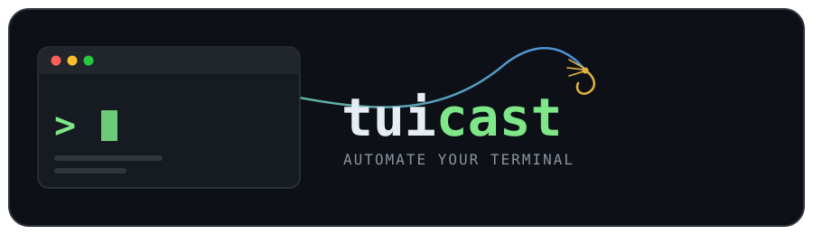

# tuicast

## Table of Contents

- [Background](#Background)
- [Installation](#installation)
- [Running the Reference TUI](#running-the-reference-tui)

## Background

- Goal
  - To create a TUI automation framework, allowing you to control a terminal based application programatically. Use cases for such a framework include:
    - End-to-end (E2E) testing - simulate a real user flow and assert the app behaves correctly
    - Automation - expose a surface for terminal applications to be integrated into automated workflows

> TUICast makes terminal-based applications testable and automatable through reliable, programmatic control of interactive terminal sessions. It abstracts connection protocols and terminal behavior so engineers can interact with legacy TUIs using deterministic, modern automation APIs.

- Background and problem
  - Some enterprise systems still use interactive terminal interfaces over SSH or Telnet. Automating them can be challenging because they are stateful screen applications rather than command-line programs:
    - Output arrives incrementally.
    - Escape sequences update an existing screen.
    - Input includes special keys, not just text.
    - Applications often provide no explicit "ready" signal.
    - Tests may need hundreds of isolated, concurrent sessions.
  - TUICast provides one abstraction over those concerns.
- Intended users
  - Engineers testing legacy enterprise TUI applications
  - Teams integrating terminal-only systems into automated workflows
  - Test-tool and SDK authors
  - AI agents or orchestration systems that need controlled TUI access
- Primary use cases
  - End-to-end testing: Perform realistic user workflows and assert screen contents, cursor position, or other terminal state.
  - Business-process automation: Integrate terminal-only applications into larger workflows.
  - Concurrency and load scenarios: Run many independent users or sessions simultaneously.
  - Observability and diagnostics: Capture terminal state and failures in a form test tools can report.
  - Language-neutral integration: Control TUICast through its driver and language SDKs.
  - AI-assisted operation: Expose a constrained terminal automation surface through MCP
- Glossary


## What's In This Project?

```
                                        ┌┈┈┈┈┈┈┈┈┈┈┈┈┈┐
                                 ┌─────▶┊ Your TUI    ┊
╔════════╗         ╔════════╗    │ ┌───▶┊ Application │
║  SDKs  ║◀───────▶║ Driver ║◀───┘ │    └┈┈┈┈┈┈┈┈┈┈┈┈┈┘
╚════════╝         ║        ║◀───┐ │
                   ╚════════╝    │ │    ╔═════════════╗
                                 └─│───▶║ Reference   ║
┌┈┈┈┈┈┈┈┈┐         ╔════════╗      │ ┌─▶║  TUI App    ║
┊ Your   ┊◀───────▶║  MCP   ║◀─────┘ │  ╚═════════════╝
┊ Agents ┊         ║ Server ║◀───────┘
└┈┈┈┈┈┈┈┈┘         ╚════════╝
```

### The Driver (Required)
The driver is the central piece to this project. It manages all the connections
to the TUI applications being automated and/or tested, as well as all the sessions
for each connection. For SSH connections, it authenticates using the password or
private key you supply and verifies the server's host key.

The driver exposes a JSON-RPC protocol that your application will use to:
- Open SSH and Telnet connections and terminal sessions.
- Send text, named keystrokes, and raw bytes, including escape sequences,
  to the TUI applications.
- Read the current screen, wait for expected screen content or for output
  to go idle, and subscribe to screen updates and terminal events such as
  BELL and ENQ.

The driver is a binary that must be installed and available on your PATH
when using TUICast. The JSON-RPC protocol allows for communication with
the driver from a variety of programming languages.

Go programs can also embed the TUICast library directly, without the driver.

### The SDKs
Rather than writing your own code directly against the JSON-RPC protocol supported by
the driver, we provide SDKs to make it easier to write your tests or automation code
to interact with the driver. Currently, SDKs are provided in Go, Java, Python, and Typescript.

### The MCP Server (Optional)
The MCP server included in this project will allow you to connect the driver to any
AI tools you may be using. Via the MCP server, an AI agent can utilize the driver to
connect to a TUI application, gather information about the current state of the application,
and interact with the application.

There is a separate installation for the MCP server so that you can install it (or not)
in accordance with your AI policies.

### The Reference TUI Application (Optional)
A reference TUI application is maintained as part of this project. This application
can be used during demonstrations rather than connecting to a real production application.
It is also used as part of integration testing of this project, so we have a standardized
application that can be used for deterministic tests. As new use cases are covered by this
project, the reference TUI application can be updated to include functionality that will
allow for testing and demonstration of any new functionality.


## Installation


### SDK

The SDK launches tuicast-driver, so install that separately and make sure it is available on your PATH.

#### Go

To install the SDK for Go, use go get.

```
go get github.com/castingcode/tuicast/sdk/go@latest
```

Then in your code, import the SDK as:

```
import tuicast "github.com/castingcode/tuicast/sdk/go"
```


### Driver and Other Binaries (reference tui application)


#### Homebrew

```sh
brew install --cask castingcode/tap/tuicast
```


#### WinGet

```powershell
winget install --exact --id CastingCode.TUICast
```


#### Scoop

```powershell
scoop bucket add castingcode https://github.com/castingcode/scoop-bucket.git
scoop install castingcode/tuicast
```

These packages install `tuicast-driver`, `tuicast-mcp`, and `reference-tui`.

#### Using the install script

The default destination is ./bin. Add the selected directory to PATH if necessary.

##### macOS and Linux

Install the driver into ./bin:

```
curl --proto '=https' --tlsv1.2 -LsSf \
  https://github.com/castingcode/tuicast/releases/latest/download/install.sh | sh
```

Install the reference TUI:

```
curl --proto '=https' --tlsv1.2 -LsSf \
  https://github.com/castingcode/tuicast/releases/latest/download/install.sh |
  sh -s -- --component reference-tui
```

Install everything into ~/.local/bin:

```
curl --proto '=https' --tlsv1.2 -LsSf \
  https://github.com/castingcode/tuicast/releases/latest/download/install.sh |
  sh -s -- --component all --bin-dir "$HOME/.local/bin"
```

Install a specific version:

```
curl --proto '=https' --tlsv1.2 -LsSf \
  https://github.com/castingcode/tuicast/releases/latest/download/install.sh |
  sh -s -- --component driver v0.0.1
```


##### Windows PowerShell

Install the driver:

```
$install = [scriptblock]::Create((irm `
  https://github.com/castingcode/tuicast/releases/latest/download/install.ps1))

& $install -Component driver
```

Reference TUI:

```
& $install -Component reference-tui
```

Everything in a chosen directory:

```
& $install -Component all -BinDir "$HOME\bin"
```

Specific version:

```
& $install -Component driver -Version v0.0.1
```


#### Using npm

Install the driver and reference TUI globally on macOS, Linux, or Windows:

```sh
npm install --global @castingcode/tuicast-cli
```

The installer selects the release for the current operating system and CPU,
downloads `tuicast-driver` and `reference-tui`, and verifies their SHA-256
checksums. This package is separate from the `@castingcode/tuicast` TypeScript
SDK.

#### Linux packages

Each GitHub release includes `deb`, `rpm`, and `apk` packages containing
`tuicast-driver`, `tuicast-mcp`, and `reference-tui`. Download the package for
your CPU architecture from the release and install it with the platform package
manager, for example:

```sh
sudo apt install ./tuicast_VERSION_linux_amd64.deb
```


#### Using Go install

Alternatively, you can use `go install` to install the binaries.
Ensure $GOBIN or $GOPATH/bin is on PATH, as the SDK will launch the driver.

To install, run:

```
go install github.com/castingcode/tuicast/cmd/tuicast-driver@latest
```

The reference TUI and MCP server also support go install:

```
go install github.com/castingcode/tuicast/cmd/reference-tui@latest
go install github.com/castingcode/tuicast/cmd/tuicast-mcp@latest
```


## Running the Reference TUI

The reference TUI is a deterministic terminal application for demonstrations, integration tests, and exercising TUICast automation.

### Configure credentials

The reference TUI has no default passwords, modeling how credentials should be handled for real
WMS environments. From the repository root, copy `.env.example` to `.env.local`, which Git ignores,
choose your own passwords, and load both environment files into your shell:

```sh
cp .env.example .env.local    # then set the passwords in .env.local
set -a; . ./.env; . ./.env.local; set +a
```

| Variable | Purpose |
| --- | --- |
| `TUICAST_REFERENCE_PASSWORD` | SSH password; required with `--ssh-address` |
| `TUICAST_REFERENCE_APP_PASSWORD` | Password accepted by the application's login screen, at most 24 characters; always required |

The SSH and application user IDs default to `operator`. For ease of demonstration, the login
screen displays the configured application credentials. The examples and getting-started guides
read the same variables. Without a checkout, export the two variables directly.

### Run interactively

```sh
reference-tui
```

Use `Ctrl-C` to exit.

### Serve over SSH

```sh
reference-tui --ssh-address 127.0.0.1:2222
```

Connect from another terminal:

```sh
ssh -tt \
  -o PreferredAuthentications=password \
  -o PubkeyAuthentication=no \
  operator@127.0.0.1 -p 2222
```

Authenticate as `operator` with the value of `TUICAST_REFERENCE_PASSWORD`.

Use `-ssh-username` and `-app-username` to change the user IDs. The `-ssh-password` and
`-app-password` flags are also available, but prefer the environment variables because
command-line arguments are visible to other local users.

To accept several SSH users, supply `-ssh-users-file` with the path to a JSON file mapping user
names to passwords, such as `{"operator":"...","supervisor":"..."}`. Keep that file out of version
control.

To use a stable SSH host key:

```sh
reference-tui \
  -ssh-address 127.0.0.1:2222 \
  -ssh-host-key ./host-key
```

These credentials are intended for local demonstrations and testing, not production use.

### Serve over Telnet

```sh
reference-tui -telnet-address 127.0.0.1:2323
```

Connect from another terminal:

```sh
telnet 127.0.0.1 2323
```

The SSH and Telnet address options are mutually exclusive. Start separate processes when both protocols are needed.

### Run VTTEST scenarios

The reference application can launch the external `vttest` utility from its menu. Install it separately and ensure it is on `PATH`:

```sh
brew install vttest
```

On Linux, install `vttest` through your distribution’s package manager.

## Running CI Checks Locally

The [Taskfile](Taskfile.yml) runs the same checks as the CI pipeline. Install
[Task](https://taskfile.dev/installation/), then run all jobs or one at a time:

```sh
task ci          # every job below, in order
task check       # Go formatting, vet, tests, Go examples, and the npm CLI installer
task java        # Java SDK and examples (requires Maven and Java 21)
task typescript  # TypeScript SDK and examples
task python      # Python SDK and examples (requires Python 3.12)
```

Run `task` to list the individual steps. The example tests start the reference TUI on the addresses
in `.env`; set different addresses in `.env.local` if those ports are busy. As in CI, each run
generates fresh passwords unless `.env.local` provides them.
